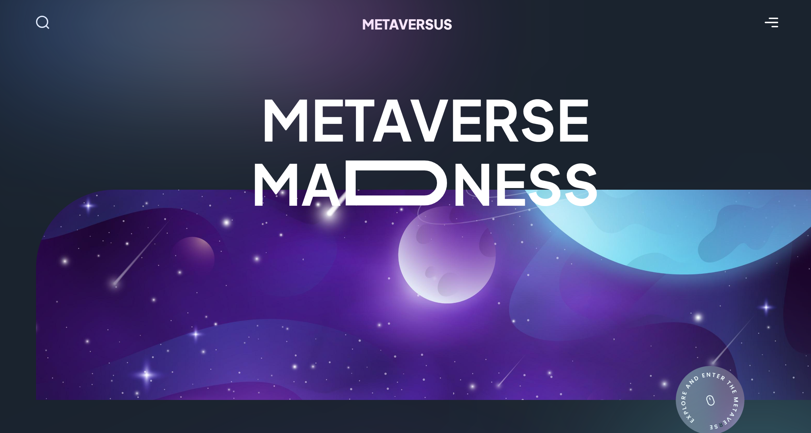

# Metaverse

[](https://metaverse-dv192.vercel.app/)

Welcome to Metaverse, a responsive website built with Next.js, HTML, CSS, and JavaScript. The project utilizes React Hooks for state management, Framer Motion for animations, and Tailwind CSS for styling.

## Getting Started

To get a local copy of this project up and running, follow these steps:

### Prerequisites

Make sure you have Node.js installed.

### Installation
Clone the repository and install dependencies.

```bash
git clone https://github.com/your-username/metaverse.git
cd metaverse
npm install
```

### Usage
Start the development server.

```bash
npm run dev
```

Visit http://localhost:3000 in your browser.

## Project Inspiration

This project was created by following the tutorial on [JavaScript Mastery YouTube Channel](https://www.youtube.com/@javascriptmastery). Special thanks to the creator for the guidance and inspiration.

## Built With

- [Next.js](https://nextjs.org/)
- HTML, CSS, JavaScript
- React Hooks
- [Framer Motion](https://www.framer.com/motion/)
- [Tailwind CSS](https://tailwindcss.com/)

## Deployment

This project is deployed on [Vercel](https://vercel.com/). Visit the live version [here](https://metaverse-dv192.vercel.app/).
